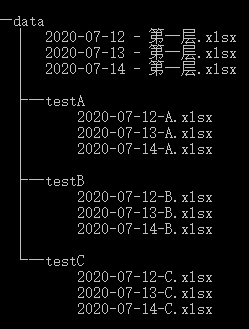

# os.walk() 方法

## 知识点

- os.walk()  输出目录中文件路径及文件名称
- `os.walk()`  输出目录中文件路径及文件名称

- print(" \* " \* 20)  连续打印2个*号

- `os.path.join()` 拼接文件夹名和文件名

- `endswith()`  截取文件后缀

- `starswith()` 判断字符串是否以指定字符串开头

- `split()` 用指定分割符将字符串拆隔成列表

- `os.rename()` 重命名文件或文件夹

- `os.remove()` 删除路径为path的文件

- `removedirs()` 递归删除目录

- `os.mkdir(path)` 创建文件夹path

- `os.listdir()` 获取文件夹下所有文件和子文件夹名称

- `append()` 给列表添加元素

- > openpyxl 只能处理.xlsx文件
    >
    > ```python
    > openpyxl.load_workbook(file_path) # 获取文件内容
    > writer=pd.ExcelWriter(file_path,engine="openpyxl")
    > #在ExcelWriter的源代码中，它初始化空工作簿并删除所有工作表，
    > #writer.book = book将原来表里面的内容保存到writer中
    > writer.book=book
    > ```

- `reset_index(drop=True,inplace=True)` pandas 中重新生成行索引（`drop=True`），直接修改原表（`inplace=True`）

## 介绍

> - os.walk() 方法用于通过在目录树中游走<font size=4 color='red'>输出目录中的文件名</font>，向上或者向下。
> - os.walk() 方法是一个简单易用的文件、目录遍历器，可以帮助我们高效的处理文件、目录方面的事情。
> - 在<font size=4 color='red'>Unix，Windows</font>中有效。

## 语法

​    **walk()**方法语法格式如下：

```
os.walk(top[, topdown=True[, onerror=None[, followlinks=False]]])
```

### 参数

- **top** -- 是你所要遍历的目录的地址, 返回的是一个三元组(root,dirs,files)。
    - root 所指的是当前正在遍历的这个文件夹的本身的地址
    - dirs 是一个 list ，内容是该文件夹中所有的目录的名字(不包括子目录)
    - files 同样是 list , 内容是该文件夹中所有的文件(不包括子目录)
- **topdown** --可选，为 True，则优先遍历 top 目录，否则优先遍历 top 的子目录(默认为开启)。如果 topdown 参数为 True，walk 会遍历top文件夹，与top 文件夹中每一个子目录。<font size=4 color='yelle'>自顶向下 topdown=True(默认)，自底向上 topdown=False</font>
- **onerror** -- 可选，需要一个 callable 对象，当 walk 需要异常时，会调用。
- **followlinks** -- 可选，如果为 True，则会遍历目录下的快捷方式(linux 下是软连接 symbolic link )实际所指的目录(默认关闭)，如果为 False，则优先遍历 top 的子目录

### 返回值

返回生成器。

## 举例说明

假设文件夹data有如下的目录结构(cmd 命令：tree /f)



### **扫描所有文件**

```python
from os import walk
path="data"
for curDir, dirs, files in walk(path): # 自顶向下扫描结果
#for curDir, dirs, files in walk(path,topdown=False): # 自底向上扫描结果：
    print("现在的目录：" ,curDir)
    print("该目录下包含的子目录：" , str(dirs))
    print("该目录下包含的文件：",str(files))
    print(" * " * 20)
```

#### 自顶向下扫描结果：

```

现在的目录：data
该目录下包含的子目录：['testA', 'testB', 'testC']
该目录下包含的文件：['2020-07-12 - 第一层.xlsx', '2020-07-13 - 第一层.xlsx', '2020-07-14 - 第一层.xlsx']
********************
现在的目录：data\testA
该目录下包含的子目录：[]
该目录下包含的文件：['2020-07-12-A.xlsx', '2020-07-13-A.xlsx', '2020-07-14-A.xlsx']
********************
现在的目录：data\testB
该目录下包含的子目录：[]
该目录下包含的文件：['2020-07-12-B.xlsx', '2020-07-13-B.xlsx', '2020-07-14-B.xlsx']
********************
现在的目录：data\testC
该目录下包含的子目录：[]
该目录下包含的文件：['2020-07-12-C.xlsx', '2020-07-13-C.xlsx', '2020-07-14-C.xlsx']
********************
```

#### 自底向上扫描结果：

```
现在的目录：data\testA
该目录下包含的子目录：[]
该目录下包含的文件：['2020-07-12-A.xlsx', '2020-07-13-A.xlsx', '2020-07-14-A.xlsx']
********************
现在的目录：data\testB
该目录下包含的子目录：[]
该目录下包含的文件：['2020-07-12-B.xlsx', '2020-07-13-B.xlsx', '2020-07-14-B.xlsx']
********************
现在的目录：data\testC
该目录下包含的子目录：[]
该目录下包含的文件：['2020-07-12-C.xlsx', '2020-07-13-C.xlsx', '2020-07-14-C.xlsx']
********************
现在的目录：data
该目录下包含的子目录：['testA', 'testB', 'testC']
该目录下包含的文件：['2020-07-12 - 第一层.xlsx', '2020-07-13 - 第一层.xlsx', '2020-07-14 - 第一层.xlsx']
********************
```

### **扫描输出所有文件的路径**

#### 输出所有文件：

```python
import os
path="data"
for curDir, dirs, files in os.walk(path):
    for file in files:
        print(os.path.join(curDir, file))
```

```

data\2020-07-12 - 第一层.xlsx
data\2020-07-13 - 第一层.xlsx
data\2020-07-14 - 第一层.xlsx
data\testA\2020-07-12-A.xlsx
data\testA\2020-07-13-A.xlsx
data\testA\2020-07-14-A.xlsx
data\testB\2020-07-12-B.xlsx
data\testB\2020-07-13-B.xlsx
data\testB\2020-07-14-B.xlsx
data\testC\2020-07-12-C.xlsx
data\testC\2020-07-13-C.xlsx
data\testC\2020-07-14-C.xlsx
```

#### 输出指定类型文件：

```
#endswith 截取文件后缀
import os
path="data"
for curDir, dirs, files in os.walk(path):
    [print(os.path.join(curDir, file)) for file in files  if file.endswith(".xlsx")]
```

#### **输出所有的子目录（子文件夹）**

```
# 使用os.walk输出某个目录下的所有文件
import os
path="data"
for curDir, dirs, files in os.walk(path):
    for _dir in dirs:
        print(os.path.join(curDir, _dir))
```

```
data\testA
data\testB
data\testC
```

## **案例代码**：文件指定日期整理程序

```python
import pandas as pd
import numpy as np
import os,openpyxl
#移动符合条件文件，并删除二级文件夹和多余文件
def move_file(file_path,_new_path,date_xl_str):

    #本月文件移动至对应新建文件夹，非本月文件直接删除
    for curDir, dirs, files in os.walk(file_path):
        for file in files:
            old_path = os.path.join(curDir, file)
            new_path = os.path.join(_new_path, file)
            file_date=file.split("_")[-1][:10] # "a_2021.11.21.xls"
            try:
                os.rename(old_path,new_path) if file_date in date_xl_str else os.remove(old_path)
            except:
                os.remove(old_path)

    #移除子文件夹
    for curDir, dirs, files in os.walk(file_path):
        for _dir in dirs:
            os.removedirs(os.path.join(curDir, _dir))
    os.mkdir("data")

#文件去重-相同日期文件
def qch_date(file_path):
    wj_names=os.listdir(file_path)
    wj_list=[]
    num=0
    for wj in wj_names:
        new_wj=wj[:-11]
        if new_wj not  in wj_list:
            wj_list.append(new_wj)
        else: 
            os.remove(file_path+"\\"+wj)
            num+=1
    return num

#更新数据源
def refresh_data(file_path,sheet_name,data):
    book=openpyxl.load_workbook(file_path)
    writer=pd.ExcelWriter(file_path,engine="openpyxl")

    #在ExcelWriter的源代码中，它初始化空工作簿并删除所有工作表，
    #writer.book = book将原来表里面的内容保存到writer中
    writer.book=book

    #activate激活指定sheet工作表
    ws=book[sheet_name]

    #清空当前活动表数据
    for row in ws.iter_rows():
        for cell in row:
            cell.value=None

    #dataframe行列数
    idx_num,col_num=data.shape

    #新数据写入当前活动表-注意索引偏移
    for i in  range(1,idx_num+1):
        for j in range(1,col_num+1):
            ws.cell(row=i,column=j).value=data.iloc[i-1,j-1]

    #保存关闭writer
    writer.save()
    writer.close()

    return None

#文件检查
def check_file(file_path,check_file="文件检查.xlsx"):
    wj_names=os.listdir(file_path)
    data=pd.DataFrame([wj.split("_")[2:] for wj in wj_names],columns=["店铺名称","日期"])
    data['日期']=data['日期'].str[:10] 

    #标题columns放到dataframe中
    nind=data.index.insert(0,'0')
    data1=data.reindex(index=nind)
    data1.loc['0']=data.columns
    data1.reset_index(drop=True,inplace=True)

    #刷新数据源
    refresh_data(check_file,"数据源",data1)

    return None

file_path="data"
#日期格式：xxxx-xx eg:2020-07-01
start_date=input("请输入开始日期：")
end_date=input("请输入结束日期：")

#生成日期区间-字符串类型
date_xl_str=[str(i)[:10] for i in pd.date_range(start_date,end_date,freq='D')]

#创建指定文件夹
new_path=start_date+"~"+end_date
try:
    os.mkdir(new_path)
except:
    print("文件夹 【%s】 已存在"%new_path)

#移动符合条件文件，并删除二级文件夹和多余文件
move_file(file_path,new_path,date_xl_str)

#文件去重
num=qch_date(new_path)
print("去除重复文件 %s 个"%num)

#文件检查
check_file(new_path)
```


